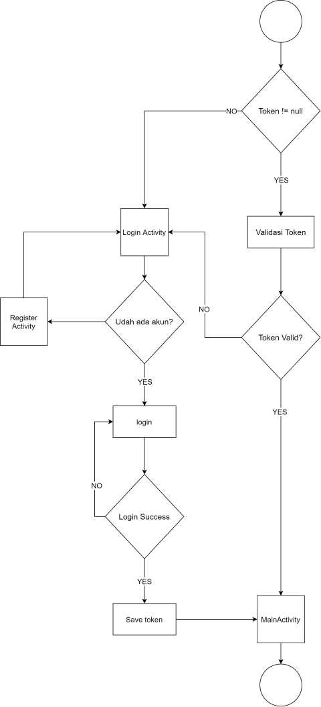
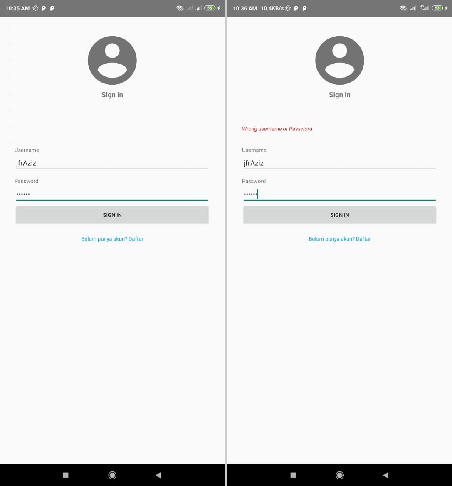
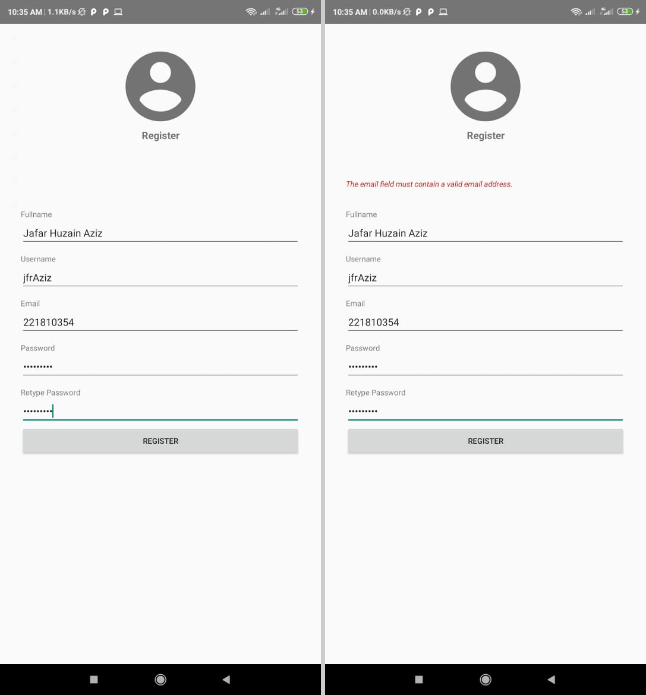
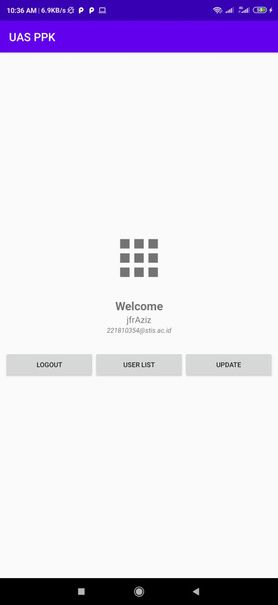
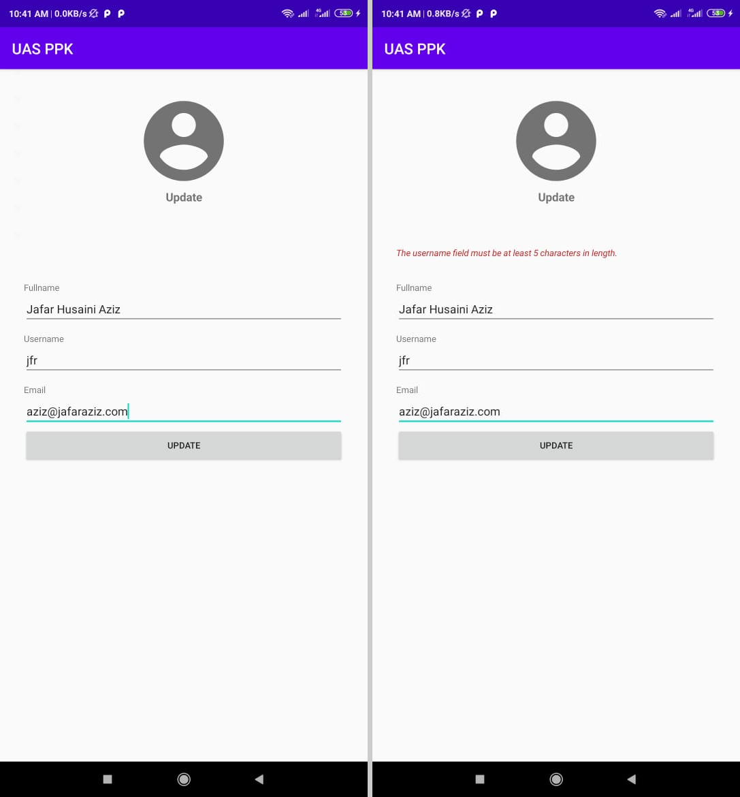
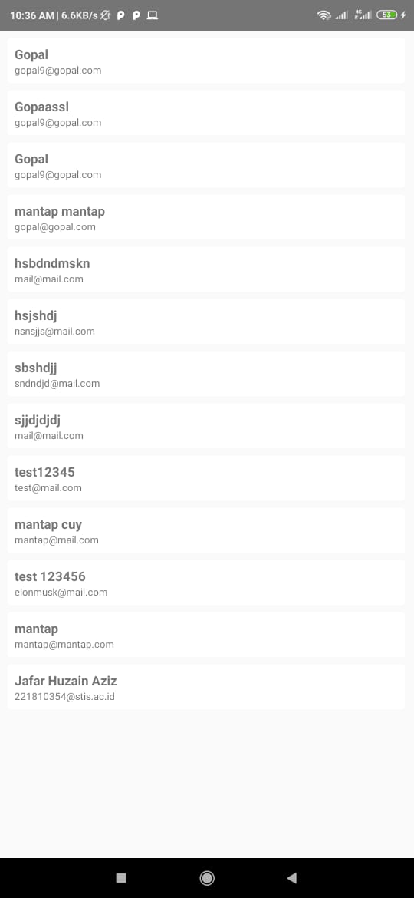

# Penjelasan singkat aplikasi

> Silahkan clone repo ini. Jalankan backend menggunakan web server seperri apache atau nginx. Jika tidak bisa terkoneksi dengan frontend coba matikan terlebih dahulu firewall nya kemudian sesuaikan IP yang ada di frontend dengan IP di computer nya, (bisa di liat di `ipconfig`).

## Backend

Backend dibuat menggunkan PHP dengan framework Codeigniter 4. Sebelum pakai, rename dulu file `env` jadi `.env` lalu sesuiakan dengan databasenya. Desain database sebagai berikut

```
users(id, username, email, name, password)
```

Endpoint yang dibuat adalah sebagai berikut

| Name           | Method | Endpoint    | AUTH (JWT) |
| -------------- | ------ | ----------- | ---------- |
| Login          | POST   | `/login`    | NO         |
| Register       | POST   | `/register` | NO         |
| Validate Token | GET    | `/validate` | YES        |
| All Users      | GET    | `/users/`   | YES        |
| User By Id     | GET    | `/users/id` | YES        |
| Update         | PUT    | `/users/id` | YES        |

Disini saya membuat 6 endpoint yang masing masing response nya berupa JSON. Saya membuat default response untuk semua endpoint untuk response yang gagal (400 -.., 500 - ..) seperti contoh berikut.

```json
{
    "status" : 401,
    "message" : "Unauthorized",
}
```

Dan berikut apa bila request berhasil dan success maka response yang diberikan adalah sebagai berikut 

1.  `register` dan `update users`

    ```json
    {
        "status" : 201,
        "message" : "Register Success", 
    }
    ```

2. `Validate Token` dan `Validate Token`

    ```json
    {
        "status" : 200,
        "message" : "Register Success", 
        "data" : {
            "id" : 1, 
            "token" "sdjahdjadhsja" 
        }
    }
    ```

3. `All Users`

    ```json
    {
        "status" : 200,
        "message" : "Register Success", 
        "data" : [ 
            ....
            {
                "id": "1",
                "email": "gopal9@gopal.com",
                "name": "Gopal",
                "username": "gopal9"
            },
            ....
        ]
    }
    ```

4. `User By Id` 

    ```json
    {
        "status" : 200, 
        "message" : "Register Success", 
        "data" : {  
            "id": "1",
            "email": "gopal9@gopal.com",
            "name": "Gopal",
            "username": "gopal9"
        },
    }
    ```


## Android

### Overview

Untuk aplikasi android saya buat menggunankan Android API Level 26 Oreo. Dependesi tambahan yang saya pakai adalah retrofit dan gson converter yang saya pakai untuk menghandle koneksi ke REST API di Bakcend yang sudah saya buat. Di dalam project yang saya buat terdapat beberapa package yang saya buat sendiri yaitu `api`, `ui`, dan `model`. `api` saya gunakan untuk menghandle REST API yang saya pakai dengan menggunakan retrofit dan didalamnya ada POJO class dan service yang saya pakai untuk mengirim request dan menerima response dari REST API yang saya buat. `model` ini hanya sebagai model class untuk entitas yang dipakai, karena entitasnya hanya user maka hanya ada 1 mode saja yaitu `User`. `ui` ini untuk menghandle UI yang saya pakai, kebetulan saya menambahkan RecyclerView untuk menampilkan data seluruh user dari API dan disini `ui` ini berisi Adapter nya.

### Activity

Activity yang saya buat ada 6 activity yaitu pada tabel berikut

| Nama Activity      | Keterangan singkat                                                                             |
| ------------------ | ---------------------------------------------------------------------------------------------- |
| AuthCheckActivity  | BlankActivity yang saya pakai untuk melakukan pengecekan di awal apakah sudah login atau belum |
| LoginActivity      | Activity untuk melakukan login                                                                 |
| RegisterActivity   | Activity untuk melakukan register                                                              |
| MainActivity       | Activity sebagai HomePage dari aplikasi                                                        |
| UserListActivity   | Activity untuk menampilkan seluruh user yang ada                                               |
| UpdateUserActivity | Activity untuk update data user                                                                |

### Flow Login

Untuk menghandle apakah user sudah login atau belum, saya lakukan di `AuthCheckActivity`. `AuthCheckActivity` ini saya buat dari `BlankActvity` atau Activity yang tidak menggunakan View, jadi saya manfaatkan sebagai tempat pengecekan apakah user sudah login atau belum. Pengecekan yang saya lakukan termasuk memvalidasi apakah token, jika ada, masih bisa digunakan dan belum expired. Flow untuk login adalah sebagai berikut



### Penyimpanan Data

Untuk penyimpanan data, saya menggunakan [`SharedPreferences`](https://developer.android.com/reference/android/content/SharedPreferences). Saya menggunakan 2 `SharedPreferences` yang saya pakai untuk menyimpan data user yang telah melakukan otentikasi dan satu lagi saya pakai untuk meyimpan data update yang dilakukan user. Untuk data yang saya simpan untuk otentikasi adalah, `user_id`, `token`, `fullname`, `email`, dan `username`.

### Screenshot

#### Tampilan Login



#### Tampilan Register



#### Tampilan Home



#### Tampilan Update



#### Tampilan UserList

